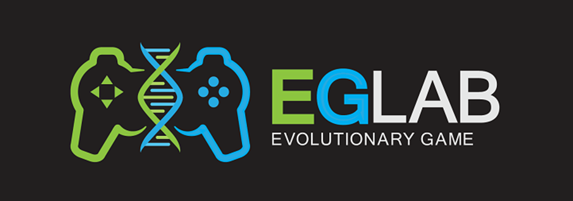
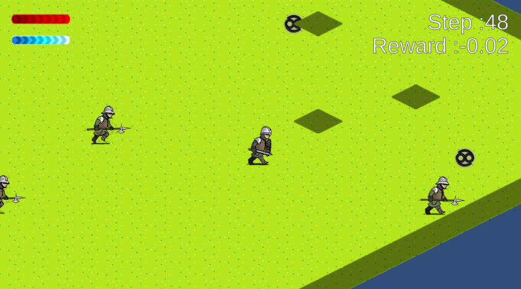
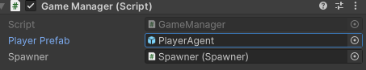
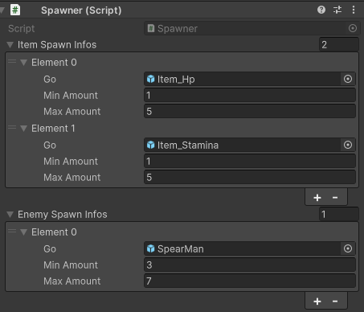
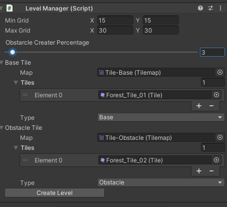

# LevelCreater(레벨 제작기)

## 기능 설명

이 프로젝트는 다음과 같은 기능을 가지고 있습니다.
- 무작위로 장애물이 생성되어진 Isometric 타입의 레벨을 생성
- 생성된 레벨을 ML-Agent가 탑재된 AI가 플레이
- AI의 Reward가 1점이상인 경우, 해당 레벨은 Json파일 변환하여 저장

## 게임 설명

- AI가 생성된 적군을 찾아 해치우고, 일정 점수를 넘기면 레벨을 재생성 하는 구조입니다.
- 공격을 할때마다 스테미너가 소모되며, 소모된 스테미너는 스테미너 아이템을 획득하여야 회복할 수 있습니다.
- AI가 일정 Step이내에 레벨을 클리어하지 못하거나, HP가 0이 된다면 레벨이 다시 재생성 됩니다.

## 실행 방법
이 프로젝트를 실행하기 위해서는 먼저 [ML-Agent](https://github.com/Unity-Technologies/ml-agents)설치가 선행되어야 합니다.
ML-Agent에 대한 설치가 완료 되었다면 유니티 내에서 프로젝트를 세팅해야합니다.

- Heirachy에 있는 GameManager에 PlayerPrefab은 원하는 바에 따라 2가지 타입을 넣으시면 됩니다.
- Player라고 되어있는 프리팹은 플레이어가 직접 조작할 수 있는 프리팹이며 PlayerAgent로 명명된 프리팹은 ML-Agent용으로 만들어진 프리팹입니다.

- GameManager의 하위 오브젝트에 있는 Spawner는 오브젝트를 생성합니다.
- 생성하는 오브젝트는 Hp회복 아이템, 스테미너 회복아이템, 적군을 생성합니다.
- Min Amount는 생성될 최소 개수이며 Max Amount는 생성될 최대 개수입니다. 이 사이의 값을 랜덤하게 골라서 맵을 생성하는 시점에 해당 개수만큼 생성합니다.

- Heirachy에 있는 LevelManager는 레벨에 대한 설정을 할 수 있는 오브젝트 입니다.
- Min grid와 Max grid는 생성될 맵의 최소 크기와 최대 크기입니다.
- Obstarcle Creater Percentage는 장애물 타일이 생성될 확률입니다. 단위는 퍼센트이며 권장사항은 2~5%사이로 맞춰주시면 됩니다.
- BaseTile은 맵에 배치되는 타일입니다. 타일 종류가 1개 이상일 경우 배치할때 랜덤 확률로 타일이 배치됩니다.
- Obstacle Tile은 장애물 타일입니다. BaseTile과 동일한 원리로 배치되지만 플레이어가 통과할 수 없는 타일입니다.

세팅이 완료되었다면 ML-Agent를 사용하여 훈련시키거나, 훈련된 모델을 사용하여 해당 프로젝트를 계속 실행시키면 됩니다.
만약 AI가 생성된 레벨을 클리어했다면 해당 레벨의 정보는 Json파일로 만들어져 저장됩니다.
